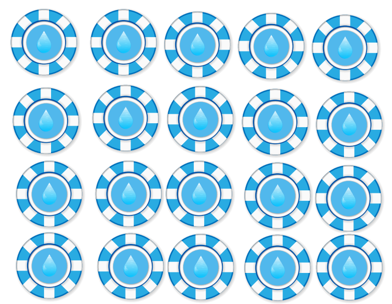
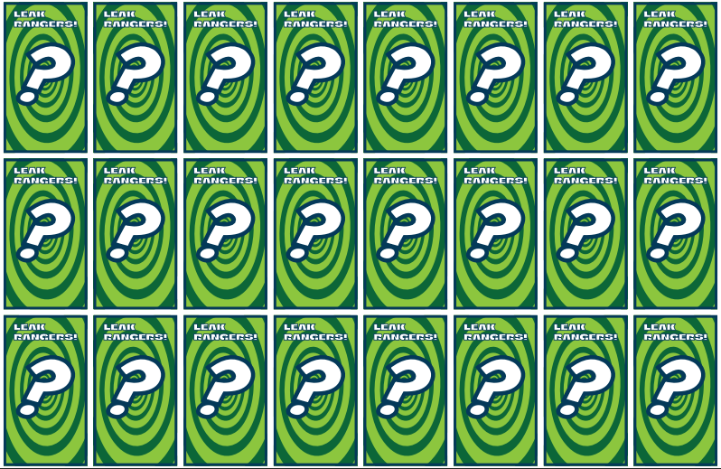
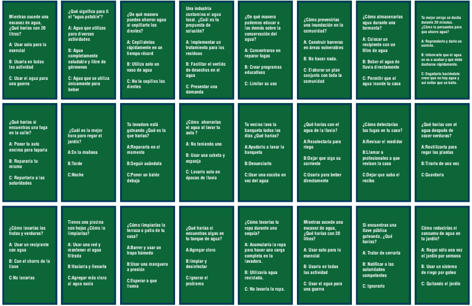
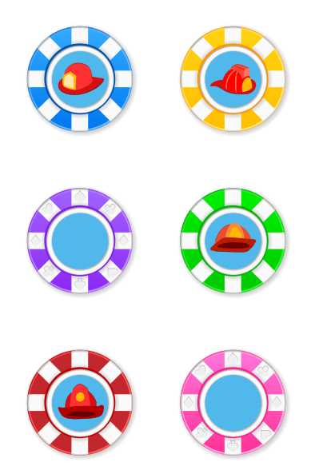
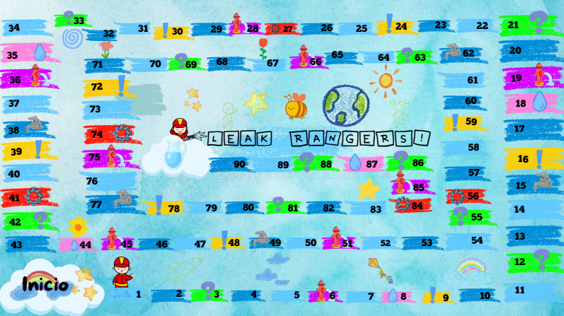

# Proyecto Semestral: Lenguajes Interpretados 

#### Integrantes: Guillermo Oropeza Reyes, Juan Alex España y Emiliano Sánchez Celis 

## Estado actual del juego fisico: Descontinuado

## Nombre: Leak Rangers

## Descripcion

### Leak Rangers es un juego de mesa que funciona similar a otros juegos de mesa con tableros interactivos al igual que Monopoly, pero con la constante de ser un juego que haga conciencia sobre el uso poco moderado del agua.

## Instrucciones

### El juego costa de 4 jugadores los cuales tienen como meta en común llegar a la meta y obtener la mayor cantidad de“AquaCoins” para ganar el juego realizando actividades y minijuegos con tus amigos. 

### Antes de todo se debe de colocar el tablero en una superficie junto a los jugadores en la linea de salida “Inicio”, con ello empezaran una tirada del dado (de mayor a menor) decidiendo quien ira primero, segundo, tercero y cuarto empezando la primera ronda de la partida.

### Para iniciar la ronda debes de tirar el dado avanzando en función del 1 al 6, tomando en cuenta que puedes caer en un evento de lo que ganas o pierdas AquaCoins. Nota: (¡En cualquier tirada te pueden tocar diferentes eventos como Preguntas, Retos o incluso Super-Fugas!).

### Eventos:
- Preguntas: Respondes una pregunta sobre el agua.

- Reto: Realizas una dinámica en donde retas al otro jugador.

- Mini-Juegos: Los jugadores en conjunto hacen un actividad
que les beneficiara en conjunto.

- Fugas: Si caes en esta casilla, pierdes 3 Aquacoins.

- Comodín: Obtienes un comodín que te protege de cualquier
castigo (incluyendo fugas).

- ¡Super Fugas!: Giras una ruleta que te puede beneficiar o
perjudicar a la par de tener otros eventos.

### AquaCoins

Las AquaCoins serán la moneda del juego que necesitas para ganar la partida, obteniéndolas al jugar por los diversos eventos entre otras formas. De igual manera puedes obtener más AquaCoins al ser el primero en llegar a la meta, contando que obtienes 10 si llegas antes que todos los demás jugadores.

### Eventos base:

- Pregunta: 1/1- AquaCoin.

- Reto: 2/-1 AquaCoin.

- Mini-juego: 3/-2 AquaCoin.

### Eventos de Super Fuga:

- +3 AquaCoins: Obtienes 3 AquaCoins.

- -1 Aquacoin: Pierdes 1 AquaCoin.

- Reto Vs: Un reto base pero el jugador puede ganar 
2 AquaCoins mas si gana.

- Mini-Juego: Mini-Juego normal. 

- !Super Fuga!: El jugador si cae en esta casilla 
puede retar a uno para intercambiar sus fichas, 
esto se decide con una tirada de dados donde 
gana el numero mayor y pierde el más pequeño. 
(El evento no aplica si es que eres el primer lugar).

### Elementos y Caraceristicas:

- Tablero (Estilo oca loca)
- Garrafa miniatura donde se llevaran las AquaCoins al final del juego
- Dado
- 4 avatares miniatura
- Cartas de pregunta
- Cartas de Retos
- Cartas de evento especial
- Cartas de comodín

### Galeria de fotos:

